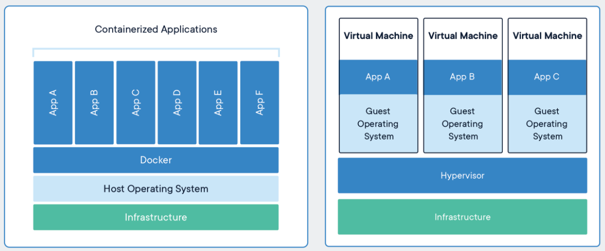

# Introduccion

## Motivación

- **Consistencia**: Queremos que nuestro servicio funcione de forma lo más independientemente posible de la infraestructura en donde está corriendo, de forma que se comporte igual en nuestros ambientes de desarrollo, de prueba y productivos.

- **Multi Plataformas Cloud**: Queremos abstraernos no solo de la infraestructura si no tambieén del servicio Cloud donde deployaremos el servicio.

- **Aislamiento**: Queremos poder correr multiples programas en un mismo host, manteniendo los recursos de cada uno aislados entre sí y del host.

## Diferencia entre una Maquina Virtual y un Container

**Containers**

Un **container** es una abstracción a nivel aplicación que permite empaquetar el codigo junto con sus dependencias. Multiples containers pueden estar corriendo en la misma maquina y compartiendo los recursos del SO, pero al mismo tiempo manteniendo los containers isolados. Los containers usan menos espacio que las VMs, pueden manejar más aplicaciones y requiren menos recursos del SO.

**Virtual Machines**

Una **virtual machine** es una abstraccion del hardware físico, que permite que múltiples VMs corran en una sola maquina física. Cada una de ellas debe tener un sistema operativo con todos los recursos que este necesita, por lo que require más espacio que una VM. 

_Fuente: https://www.docker.com/resources/what-container_

##  ¿Qué es Docker?

Docker es una herramienta que permite empaquetar aplicaciones en containers con todo lo que necesitan para correr: codigo, dependencias, herramienta, archivos de configuración, etc. De esta forma, se puede garantizar que la aplicación funcione independientemente del ambiente.

### Definiciones

- Container: Empaquetado con todo lo que se necesita para levantar nuestro servicio.

- Imagen: Puede ser definida como el _template_ de un container.

- Dockerfile: Archivo en texto plano donde se especifica qué tiene que tener nuestro container.

- Repositorio: Se pueden subir las imagenes a un repositorio para que luego pueda ser descargada. Por ejemplo, en [Docker Hub](https://hub.docker.com/) se encuentra una serie de imagenes oficiales para descargas.

[< Inicio](README.md) | [Hello World >](01_hello_world.md)
