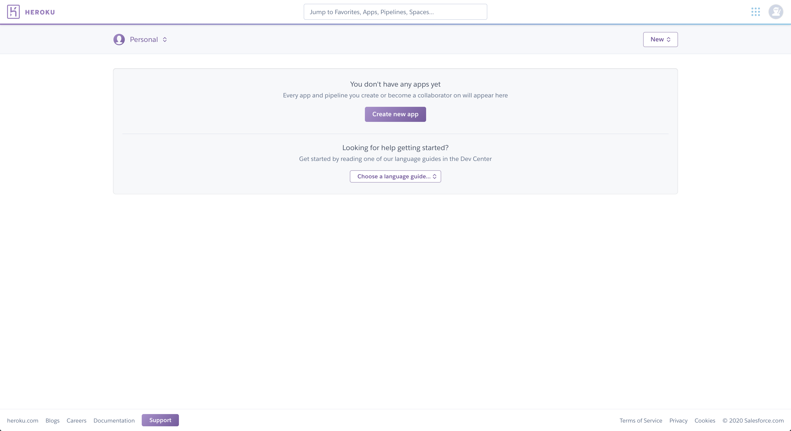
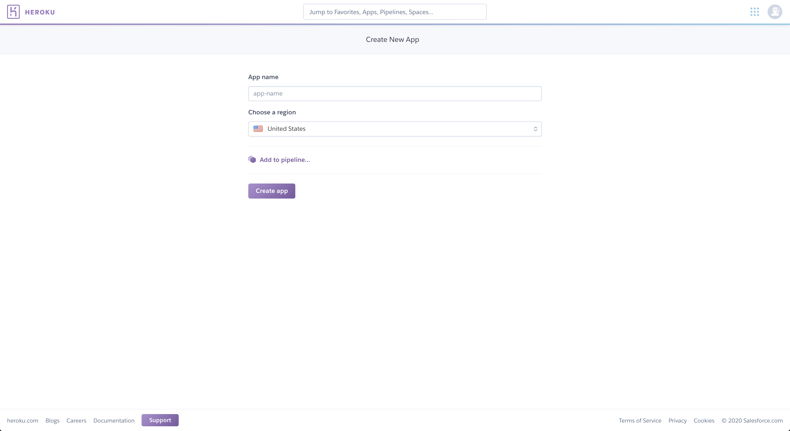
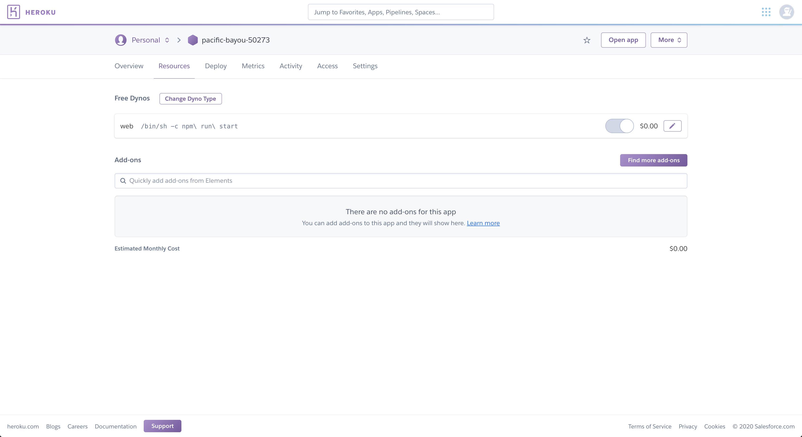
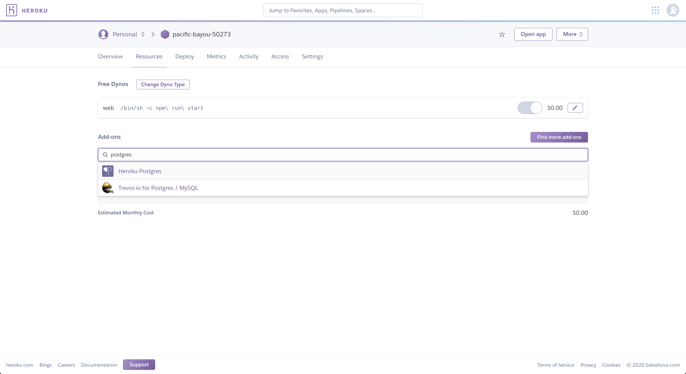
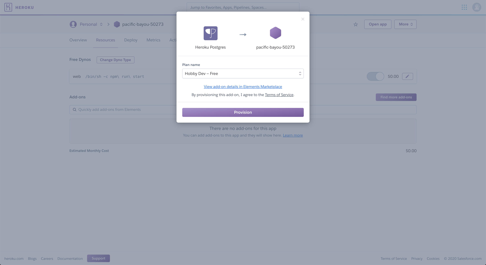
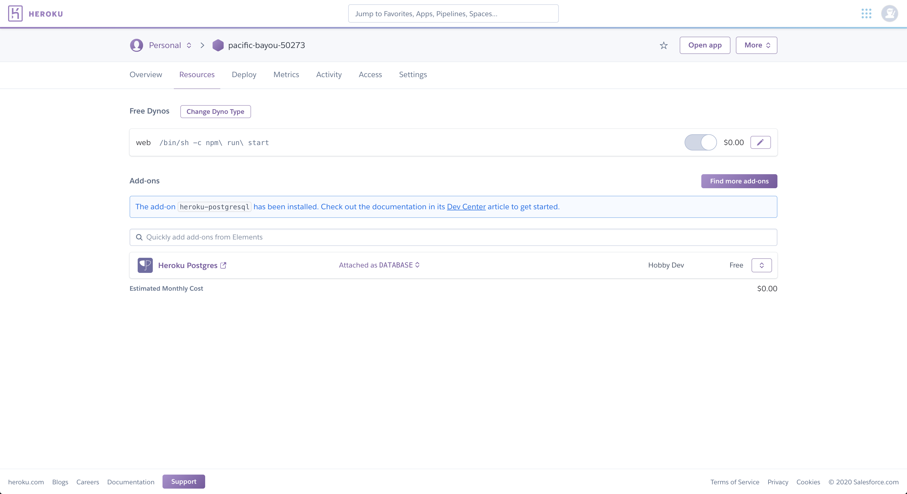

# Paso 5: Deployamos nuestra app a Heroku

## Deploy a Heroku

> Nota: Para poder usar el comando `heroku` desde la temrinal deberán instalar Heroku CLI, siguiendo los siguientes pasos: https://devcenter.heroku.com/articles/heroku-cli

Para deployar un container a Heroku deberemos:

1) Loggearnos a Heroku:

    ```
    heroku login
    ```

2) Crear un app:

    **Desde la terminal**

    ```
    heroku create
    ```
    
    El output debería ser algo así:

    ```
    Creating app... done, ⬢ pacific-bayou-50273
    https://pacific-bayou-50273.herokuapp.com/ | https://git.heroku.com/pacific-bayou-50273.git
    ```

    **Desde la web de Heroku**

    
    


3) Loggearnos en el Registry de Heroku:

    ```
    heroku container:login
    ```

    ó

    ```
    docker login --username=_ --password=$(heroku auth:token) registry.heroku.com
    ```


4) Taggear la imagen que queremos pushear al Registry de Docker con el formato `registry.heroku.com/<app>/<process-type>` (en nuestro caso el `process-type` es `web`).

    ```
    docker tag node-service registry.heroku.com/pacific-bayou-50273/web
    ```

5) Pushear la imagen al registry de Heroku:

    ```
    docker push registry.heroku.com/pacific-bayou-50273/web
    ```

6) Releasear la imagen a Heroku:

    ```
    heroku container:release web
    ```

7) Ahora deberíamos poder verificar que nuestra app este levantada realizando:

    ```
    curl https://pacific-bayou-50273.herokuapp.com/ping
    ```

    Pero al hacer:

    ```
    curl https://pacific-bayou-50273.herokuapp.com/status
    ```

    Deberíamos notar que nuestra DB no está funcionando, ya que solo deployamos nuestro servicio.

    **Nota**: Heroku asigna aleatoriamente un valor a la variable de entorno `PORT` y expone este puerto.

8) Instalar un db en Heroku:

    
    
    
    

    Ahora, al hacer:

    ```
    curl https://pacific-bayou-50273.herokuapp.com/status
    ```

    Deberíanos ver que la db está funcionando.

[< Agregamos una DB](04_database.md) | [Inicio >](README.md)